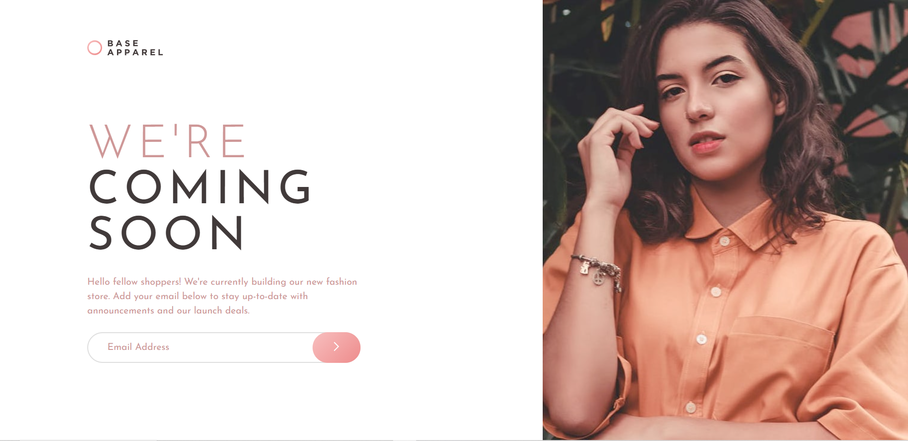
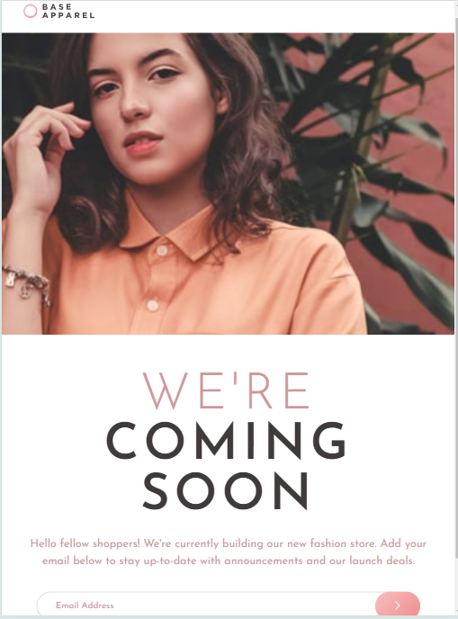
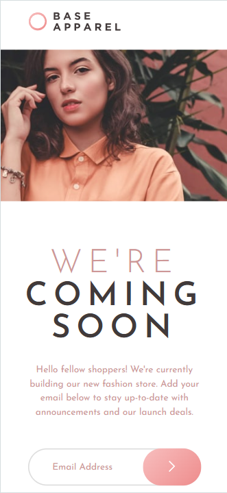

# Frontend Mentor - Base Apparel coming soon page solution

This is a solution to the [Base Apparel coming soon page challenge on Frontend Mentor](https://www.frontendmentor.io/challenges/base-apparel-coming-soon-page-5d46b47f8db8a7063f9331a0). Frontend Mentor challenges help you improve your coding skills by building realistic projects.

## Table of contents

- [Overview](#overview)
  - [The challenge](#the-challenge)
  - [Screenshot](#screenshot)
  - [Links](#links)
- [My process](#my-process)
  - [Built with](#built-with)
- [Author](#author)

## Overview

### The challenge

Users should be able to:

- View the optimal layout for the site depending on their device's screen size
- See hover states for all interactive elements on the page
- Receive an error message when the `form` is submitted if:
  - The `input` field is empty
  - The email address is not formatted correctly

### Screenshot





### Links

- Solution URL: https://github.com/usman-97/base-apparel-coming-soon-page
- Live Site URL: https://usman-97.github.io/base-apparel-coming-soon-page/

## My process

### Built with

- Semantic HTML5 markup
- CSS custom properties
- Flexbox
- CSS Grid
- CSS Media Queries

```html
<div class="header-mobile">
  
  
</div>
```

```css
.header {
  display: flex;
  justify-content: start;
  align-items: center;
  height: 200px;
  margin-bottom: 10%;
}

.content {
  grid-column: 1 / 3;
  width: 100%;
  display: flex;
  flex-direction: column;
  padding-left: 25%;
  padding-bottom: 25%;
}
```

```js
document.getElementById("submitButton").addEventListener("click", () => {
  let email = document.getElementById("emailAddressField");
  const isValidEmailAddress = String(email.value)
    .toLowerCase()
    .match(
      /^(([^<>()[\]\\.,;:\s@"]+(\.[^<>()[\]\\.,;:\s@"]+)*)|.(".+"))@((\[[0-9]{1,3}\.[0-9]{1,3}\.[0-9]{1,3}\.[0-9]{1,3}\])|(([a-zA-Z\-0-9]+\.)+[a-zA-Z]{2,}))$/
    );
  let emailAddressError = document.getElementById("emailAddressError");
  if (!isValidEmailAddress) {
    emailAddressError.textContent = "Please provide a valid email";

    email.style.backgroundImage = "url(images/icon-error.svg)";
    email.style.backgroundPosition = "25em";
    email.style.backgroundRepeat = "no-repeat";
  } else {
    emailAddressError.textContent = "";
    email.style.backgroundImage = "";
  }
});
```

## Author

- Frontend Mentor - [@usman-97](https://www.frontendmentor.io/profile/usman-97)
